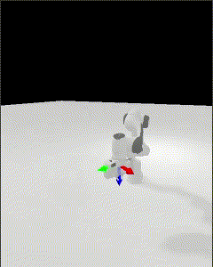

.. constrained_planning

Constrained Planning
====================

This is a simple implementation of a constrained planner. It is based on OMPL's projection-based planner. Roughly, OMPL does sampling based planning and projects a joint configuration into a valid configuration using the constrained function we provide. The above gif shows the robot execute two trajectories. The first one generated with constraint that the z-axis of the endeffector pointing downwards. The second one generated without any constraints. We can see that the second trajectory tilts the endeffector sideways.

Defining the Constrained Function
---------------------------------

The constrained function is a :math:`R^d \rightarrow R` function that evaulates to zero when the configuration is valid and non-zero otherwise. In this example, we define a constrained function that evaluates to zero when the z-axis of the endeffector is pointing downwards.

.. literalinclude:: ../../../mplib/examples/constrained_planning.py
   :language: python
   :lines: 48-52

Moreover, due to the projection-based method, we also need to provide the jacobian of the constrained function. In this example, we define the jacobian of the constrained function as follows.

.. literalinclude:: ../../../mplib/examples/constrained_planning.py
   :language: python
   :lines: 62-71

One can usually calculate the jacobian of the constraint by manipulating the jacobian of the forward kinematics. We need the jacobian calculation to be fast or else the planner will be slow. In the case above, we used the single link jacobian of the endeffector and used its rotational part to calculate how much the z-axis of the endeffector is changing.

Using the Constrained Planner
-----------------------------

The interface to the constrained planner is just some parameters when calling the planning function. We need to pass in the constrained function as well as its jacobian. Optinally, pass in the tolerance for the projection.

.. literalinclude:: ../../../mplib/examples/constrained_planning.py
   :language: python
   :lines: 99-109
   :emphasize-lines: 8-10
