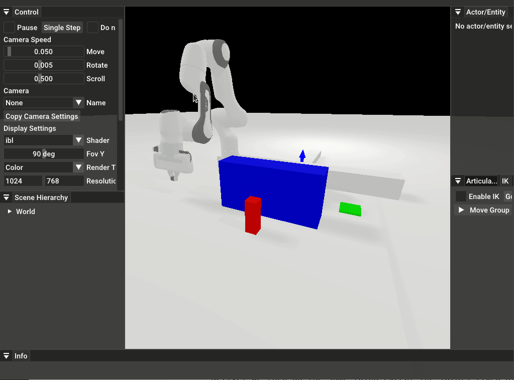

.. planning_with_fixed_joints

Planning With Fixed Joints
==========================

The planner also has the ability to temporarily fix certain joints during planning. The above shows the robot arm move by itself to pick up a red cube before staying in place and letting the base carry the fixed arm. For this tutorial, we will need a different URDF than the one we have used in the previous tutorials. In particular, this URDF has a set of x and y linear tracks that allows the arm to move horizontally. To load this URDF, we do the following:

.. literalinclude:: ../../../mplib/examples/two_stage_motion.py
   :language: python
   :start-after: self.setup_scene()
   :end-before: # Set initial joint positions

The optional `link_names` and `joint_names` parameters used to order the joints and links in a certain way are in this case used to show what the joints of the models are. Then, we set up the planning scene as usual and first move the arm on the track before moving the arm itself to grab the object.

.. literalinclude:: ../../../mplib/examples/two_stage_motion.py
   :language: python
   :start-after: # pickup ankor
   :end-before: # pickup ankor end
   :emphasize-lines: 12

Notice we have abstracted away how to decouple this motion into two stages. Here is the function definition:

.. literalinclude:: ../../../mplib/examples/two_stage_motion.py
   :language: python
   :start-after: # move_in_two_stage ankor
   :end-before: # move_in_two_stage ankor end
   :emphasize-lines: 16

The highlighted line is how we ignore the arm joints during planning. We ignore joints 2-9, keeping only joint 0 and 1 active. We then do the same thing except the joints fixed are 0 and 1, and the active joints are 2-9.
